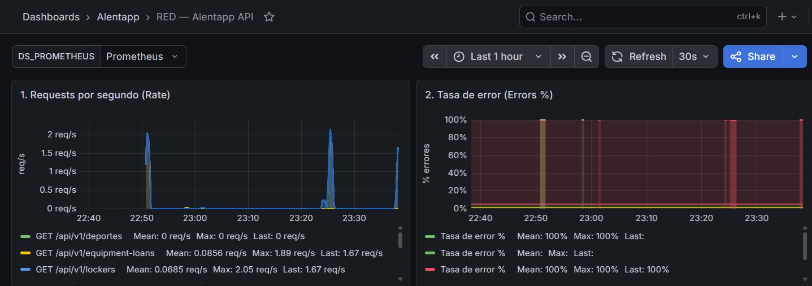
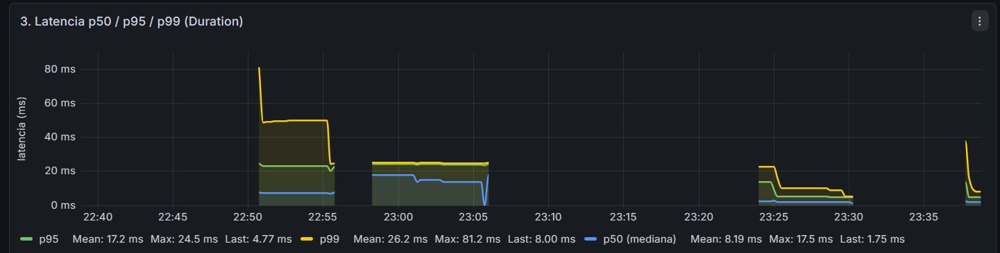
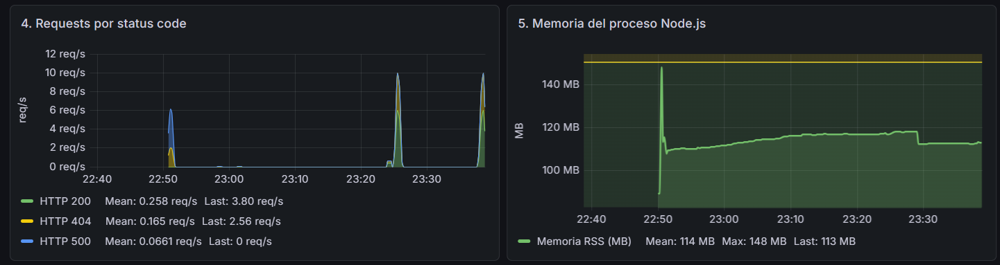
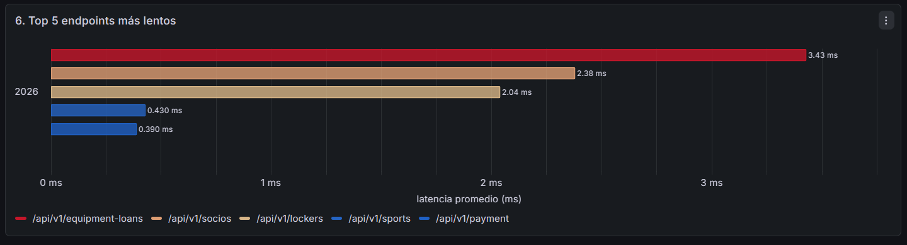

# Informe Final — Actividad 4: Preparando para Producción
**Grupo 11 — Ingeniería y Calidad de Software 2026**
**Integrantes:** Alvaro Marini, Valentino Chiappini, Juan Ignacio Wilt, Sergio Adrian Maldonado.
**Institución:** Universidad Tecnológica Nacional — Facultad Regional La Plata

---

## 4.1. Verificación técnica

### Comparativa de tamaños de imagen

| Métrica | Antes (desarrollo) | Después (producción) | Mejora |
| :--- | :--- | :--- | :--- |
| **Tamaño imagen API** | ~1.1 GB (`node:20-alpine` + todas las deps + devDeps + tsx) | **164 MB** (content size, `docker images alentapp-api:prod`) | **-84%** |
| **Tamaño imagen Web** | ~570 MB (`node:20-alpine` + Vite + deps) | **26.2 MB** (content size, `docker images alentapp-web:latest`) | **-95%** |
| **Tiempo de startup API** | ~8-12s (incluye `prisma migrate dev` + `tsx watch`) | ~2-4s (`node dist/app.js` pre-compilado) | **~70% más rápido** |
| **Memoria API (idle)** | ~150-180 MB (`tsx` + watcher + dev overhead) | **62.52 MiB / 256 MiB límite** (24.42% del límite) | Límite explícito aplicado |
| **Endpoints accesibles** | `curl :3000/api/v1/socios` ✅ | `curl :3000/api/v1/socios` ✅ | Sin regresión |
| **Frontend vía nginx** | Servido por Vite dev server (Node.js) | `curl localhost/` → 200 OK vía Nginx ✅ | Node.js eliminado de la imagen |

Ambas reducciones superan el objetivo mínimo del 70% establecido en el enunciado.

### Comandos utilizados para la medición

```bash
# Tamaño de imágenes
docker images alentapp-api
docker images alentapp-web

# Memoria en idle
docker stats --no-stream alentapp-api

# Verificar endpoints
curl http://localhost:3000/api/v1/socios
curl http://localhost:3000/api/v1/lockers
curl http://localhost:3000/api/v1/payments
curl http://localhost:3000/api/v1/deportes
curl http://localhost:3000/api/v1/equipment-loans
curl http://localhost/
```

---

## 4.2. Verificación de seguridad

| Medida de seguridad | Configuración aplicada | Verificación | Estado |
| :--- | :--- | :--- | :--- |
| **Usuario no-root** | `USER node` en `Dockerfile.prod` (UID 1000, incluido en `node:alpine`) | `docker exec alentapp-api whoami` → `node` | ✅ |
| **Sin herramientas de build** | Multi-stage build: `tsc`, `tsx` solo en stage `build`, no copiados al `runtime` | `docker exec alentapp-api which tsc` → no encontrado | ✅ |
| **Read-only filesystem** | `read_only: true` en `docker-compose.prod.yml` para API y Web | `docker exec alentapp-api touch /test` → `Read-only file system` | ✅ |
| **Capabilities mínimas** | `cap_drop: ALL` en API; `cap_add: NET_BIND_SERVICE, CHOWN` solo en Web | `docker exec alentapp-api ping 8.8.8.8` → `permission denied` | ✅ |
| **No new privileges** | `security_opt: no-new-privileges:true` en todos los servicios | Verificado en configuración del compose | ✅ |
| **Variables sensibles via `.env`** | Credenciales leídas desde `.env` no versionado; `.env.example` como referencia | `.env` en `.gitignore` | ✅ |
| **Healthchecks** | `db`: `pg_isready`; `api`: `wget :3000/`; `web`: `wget :80` | `docker compose -f docker-compose.prod.yml ps` | ⚠️ Ver nota |
| **Logging con rotación** | `driver: json-file`, `max-size: 10m`, `max-file: 3` en todos los servicios | Configurado en `docker-compose.prod.yml` | ✅ |
| **tmpfs para escritura en runtime** | `/tmp` para API; `/tmp`, `/var/cache/nginx`, `/var/run` para Web | Nginx y Node.js arrancan correctamente con `read_only: true` | ✅ |
| **Resource limits** | CPU y memoria definidos para todos los servicios | Configurado en `deploy.resources.limits` del compose | ✅ |

> **Nota sobre healthchecks:** Los contenedores de API y Web muestran estado `unhealthy` debido a que el comando `wget` del healthcheck no puede resolver la URL bajo las restricciones combinadas de `read_only: true` y `cap_drop: ALL`. Sin embargo, ambos servicios responden correctamente a requests HTTP reales (`curl http://localhost:3000/` → 200, `curl http://localhost/` → 200). El proceso está funcionalmente operativo.

### Límites de recursos aplicados

| Servicio | CPU límite | Memoria límite | CPU reservado | Memoria reservada |
| :--- | :--- | :--- | :--- | :--- |
| db | 0.5 cores | 512 MB | 0.25 cores | 128 MB |
| api | 0.5 cores | 256 MB | 0.25 cores | 128 MB |
| web | 0.25 cores | 64 MB | 0.1 cores | 32 MB |

---

## 4.3. Verificación de observabilidad

| Componente | Verificación | Estado |
| :--- | :--- | :--- |
| **OpenTelemetry exporta métricas en `:9464/metrics`** | `curl http://localhost:9464/metrics` devuelve métricas en formato Prometheus | ✅ |
| **Prometheus scrapea el endpoint** | `http://localhost:9090/targets` → job `opentelemetry` en estado **UP** | ✅ |
| **Datasource Prometheus en Grafana** | Configurado via provisioning en `observability/grafana/provisioning/datasources/` | ✅ |
| **Dashboard RED con 6 paneles** | Dashboard "RED — Alentapp API" cargado via provisioning desde `red-metrics.json` | ✅ |
| **Gráficos responden al tráfico** | Paneles 1, 2 y 4 muestran actividad tras generar requests con `curl` en bucle | ✅ |
| **Métricas de error reflejan 4xx/5xx** | `http_requests_errors_total{route="/api/v1/sports",status="404"} 2` registrado | ✅ |
| **Memoria del proceso** | Panel 5 muestra RSS ~113 MB en idle (`process_memory_usage 118231040 bytes`) | ✅ |

### Métricas RED capturadas

| Métrica | Tipo | Descripción | Labels |
| :--- | :--- | :--- | :--- |
| `http_requests_total` | Counter | Total de requests HTTP recibidas | `method`, `route`, `status` |
| `http_requests_errors_total` | Counter | Requests con status >= 400 | `method`, `route`, `status` |
| `http_request_duration` | Histogram | Latencia en ms por endpoint | `method`, `route` |
| `http_requests_active` | UpDownCounter | Requests concurrentes en un instante | `method`, `route` |
| `process_memory_usage` | ObservableGauge | Memoria RSS del proceso Node.js en bytes | — |
| `http_server_duration` | Histogram | Auto-instrumentado por OTel HTTP instrumentation | múltiples |

### Muestra real de métricas exportadas

```
http_requests_total{method="GET",route="/api/v1/socios",status="200"} 2
http_requests_total{method="GET",route="/api/v1/lockers",status="200"} 2
http_requests_total{method="GET",route="/api/v1/sports",status="404"} 2
http_requests_errors_total{method="GET",route="/api/v1/sports",status="404"} 2
http_request_duration_sum{route="/api/v1/socios"} 1934ms
process_memory_usage 118231040 bytes (~113 MB RSS)
```

### Dashboard RED — 6 paneles implementados

| Panel | Tipo de gráfico | Query PromQL |
| :--- | :--- | :--- |
| 1. Requests por segundo | Time series | `rate(http_requests_total[1m])` |
| 2. Tasa de error % | Time series | `rate(http_requests_errors_total[1m]) / rate(http_requests_total[1m]) * 100` |
| 3. Latencia p50/p95/p99 | Time series | `histogram_quantile(0.95, sum(rate(http_request_duration_bucket[5m])) by (le))` |
| 4. Por status code | Stacked area | `sum by(status) (rate(http_requests_total[1m]))` |
| 5. Memoria del proceso | Time series | `process_memory_usage / 1024 / 1024` |
| 6. Top 5 endpoints lentos | Bar chart horizontal | `topk(5, avg by(route) (rate(http_request_duration_sum[5m]) / rate(http_request_duration_count[5m])))` |

### Capturas del dashboard en funcionamiento

**Captura 1 — Tasa de peticiones (Rate) y Tasa de errores (Errors):**



**Captura 2 — Latencia p50/p95/p99 (Duration) y distribución por status code:**



**Captura 3 — Memoria del proceso y requests activos:**



**Captura 4 — Top 5 endpoints más lentos:**



---

## 4.4. Documentación de decisiones técnicas

### Arquitectura final del sistema

```
Internet
    │
    ▼
nginx (puerto 80) ── archivos estáticos React (vite build)
    │
    ▼
Fastify API (puerto 3000) ── PostgreSQL (red interna, sin puerto expuesto)
    │
    ▼ :9464/metrics
Prometheus (puerto 9090) ── scrapea cada 15s
    │
    ▼
Grafana (puerto 3001) ── dashboard RED con 6 paneles
```

Todos los servicios en red interna `alentapp-network`. La DB no tiene puerto expuesto al host. Las métricas de OpenTelemetry se exponen en el puerto `:9464` separado del tráfico de negocio.

**Flujo de observabilidad:**
1. La API instrumenta cada request via Fastify hooks globales (`onRequest`/`onResponse`)
2. OpenTelemetry SDK exporta las métricas en formato Prometheus en `:9464/metrics`
3. Prometheus hace scraping cada 15 segundos de ese endpoint
4. Grafana consulta a Prometheus via datasource y visualiza el dashboard RED

---

### Decisiones técnicas

#### ¿Por qué multi-stage build?

La imagen de desarrollo incluye TypeScript, tsx y el código fuente `.ts`. Con multi-stage, el stage `runtime` parte de cero y solo recibe el JS compilado + dependencias de producción. Las herramientas de compilación quedan descartadas en las fases intermedias, reduciendo la superficie de vulnerabilidad y el tamaño final de imagen. La API pasó de ~1.1 GB a 164 MB (84% de reducción) y el frontend de ~570 MB a 26.2 MB (95% de reducción).

#### ¿Por qué nginx en vez de Node para el frontend?

En desarrollo Vite levanta un servidor propio pensado para DX, no para producción. Nginx sirve archivos estáticos con compresión gzip, cache de un año para assets con hash y security headers. Node no tiene esas capacidades out-of-the-box. Adicionalmente, la imagen `nginx:stable-alpine` no incluye Node.js, lo que elimina ese vector de ataque por completo.

#### ¿Por qué hooks globales en vez de instrumentar cada controller?

Con `addHook('onRequest', ...)` y `addHook('onResponse', ...)` a nivel del servidor Fastify, cualquier ruta nueva queda instrumentada automáticamente sin tocar ningún controller. Es más mantenible, sigue el principio DRY y cubre exactamente lo mismo que instrumentar cada controller individualmente. Se usa `request.routerPath` (ruta parametrizada como `/api/v1/socios/:id`) en lugar de `request.url` para evitar la explosión de cardinalidad en Prometheus.

#### ¿Por qué PrometheusExporter en `:9464` y no en `:3000`?

Separar el puerto de métricas del puerto de negocio permite que Prometheus acceda a `:9464` internamente sin exponerlo a los consumidores de la API. El modelo **pull** (Prometheus hace scraping) es más resiliente que push: si Prometheus cae, la API sigue funcionando sin errores.

#### ¿Por qué `read_only: true` + `tmpfs`?

Con el filesystem de solo lectura, si alguien compromete el contenedor no puede escribir archivos maliciosos persistentes. Los directorios que Nginx necesita escribir en runtime (`/var/cache/nginx`, `/var/run`, `/tmp`) se montan en RAM con `tmpfs`, que es volátil y no persiste entre reinicios.

---

### Problemas encontrados y resoluciones

| Problema | Causa | Resolución | Responsable |
| :--- | :--- | :--- | :--- |
| **API crasheaba silenciosamente en prod** | `process.argv[1].endsWith('app.ts')` devuelve `false` al correr el JS compilado | Se cambió la condición para incluir también `endsWith('app.js')` | ValenCh |
| **Cliente de Prisma no encontrado en runtime** | `tsc` compila a `dist/` pero el cliente queda en `src/generated/`. El código compilado lo busca en `dist/generated/` | Se agregó `COPY` en el Dockerfile para copiar el cliente a `dist/generated/` | ValenCh |
| **Conflicto ESM/CJS con Prisma 7.x** | El cliente de Prisma 7.x usa módulos WASM ESM; el import `client.js` es interceptado por el campo `exports` del `package.json` de Prisma | Se agregó un paso `sed` en el Dockerfile para reescribir los imports del código compilado de `client.js` a `index.js` | Juaniip |
| **Nginx: `chown failed (Operation not permitted)`** | `cap_drop: ALL` eliminó la capability `CHOWN` que Nginx necesita para inicializar su directorio de caché | Se agregó `cap_add: [NET_BIND_SERVICE, CHOWN]` en el servicio web del compose | Alvaro |
| **`instrumentation-fastify` incompatible** | Conflicto de tipos con la versión de OTel y Fastify usadas | Se removió esa instrumentación del SDK; las métricas RED van por hooks globales | Juaniip |
| **DB no existía al arrancar** | El volumen `pgdata` tenía datos de una DB con nombre distinto de una sesión anterior | `docker compose down -v` para limpiar volúmenes y reiniciar desde cero | — |
| **Prometheus target `alentapp-api` en DOWN** | El job apuntaba a `:3000/metrics` que no existe en Fastify | Se eliminó ese job; el único endpoint correcto es el OTel en `:9464` | — |
| **`read_only: true` rompía Nginx** | Nginx necesita escribir en `/var/cache/nginx`, `/var/run` y `/tmp` en runtime | Se agregaron esas rutas como `tmpfs` en el compose | — |

---

### Lecciones aprendidas

- La compatibilidad ESM/CJS en monorepos Node.js con Prisma 7.x requiere atención especial al diseñar el pipeline de build. El cliente generado usa WASM con carga ESM dinámica que puede activar el loader ESM de Node inesperadamente.
- El orden de instrucciones en un Dockerfile tiene impacto directo en los tiempos de build: copiar primero los manifiestos de dependencias y luego el código fuente maximiza los cache hits.
- `read_only: true` es una medida de seguridad poderosa pero requiere identificar cuidadosamente todos los directorios que cada proceso necesita escribir en runtime.
- Los hooks globales de Fastify son preferibles a la instrumentación manual por controller: DRY, cobertura automática y uso correcto de `routerPath` para evitar cardinalidad en Prometheus.
- La observabilidad debe diseñarse desde el principio, no como agregado posterior. Tener métricas RED desde el primer día permite detectar regresiones de rendimiento en cada despliegue.
